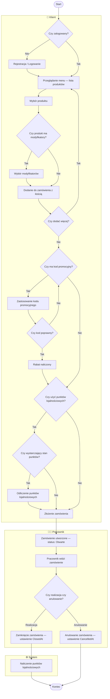

# Proces biznesowy 1 — Zamówienie online

```mermaid
flowchart TD
    Start([Start])

    subgraph Klient["🧑 Klient"]
        Login{Czy zalogowany?}
        Register[Rejestracja / Logowanie]
        Browse[Przeglądanie menu — lista produktów]
        SelectProduct[Wybór produktu]
        HasModifiers{Czy produkt ma modyfikatory?}
        ChooseModifiers[Wybór modyfikatorów]
        AddToOrder[Dodanie do zamówienia z ilością]
        MoreItems{Czy dodać więcej?}
        HasPromo{Czy ma kod promocyjny?}
        ApplyPromo[Zastosowanie kodu promocyjnego]
        ValidPromo{Czy kod poprawny?}
        DiscountApplied[Rabat naliczony]
        LoyaltyCheck{Czy użyć punktów lojalnościowych?}
        CheckBalance{Czy wystarczający stan punktów?}
        DeductPoints[Odliczenie punktów lojalnościowych]
        PlaceOrder[Złożenie zamówienia]
    end

    subgraph Pracownik["👨‍🍳 Pracownik"]
        OrderCreated[Zamówienie utworzone — status: Otwarte]
        StaffSees[Pracownik widzi zamówienie]
        Fulfill{Czy realizacja czy anulowanie?}
        CloseOrder[Zamknięcie zamówienia — ustawienie ClosedAt]
        CancelOrder[Anulowanie zamówienia — ustawienie CancelledAt]
    end

    subgraph System["⚙️ System"]
        EarnPoints[Naliczenie punktów lojalnościowych]
    end

    Start --> Login
    Login -- Nie --> Register --> Browse
    Login -- Tak --> Browse
    Browse --> SelectProduct
    SelectProduct --> HasModifiers
    HasModifiers -- Tak --> ChooseModifiers --> AddToOrder
    HasModifiers -- Nie --> AddToOrder
    AddToOrder --> MoreItems
    MoreItems -- Tak --> Browse
    MoreItems -- Nie --> HasPromo
    HasPromo -- Tak --> ApplyPromo --> ValidPromo
    ValidPromo -- Tak --> DiscountApplied --> LoyaltyCheck
    ValidPromo -- Nie --> HasPromo
    HasPromo -- Nie --> LoyaltyCheck
    LoyaltyCheck -- Tak --> CheckBalance
    CheckBalance -- Tak --> DeductPoints --> PlaceOrder
    CheckBalance -- Nie --> PlaceOrder
    LoyaltyCheck -- Nie --> PlaceOrder

    PlaceOrder --> OrderCreated
    OrderCreated --> StaffSees
    StaffSees --> Fulfill
    Fulfill -- Realizacja --> CloseOrder
    Fulfill -- Anulowanie --> CancelOrder

    CloseOrder --> EarnPoints
    EarnPoints --> End([Koniec])
    CancelOrder --> End
```
