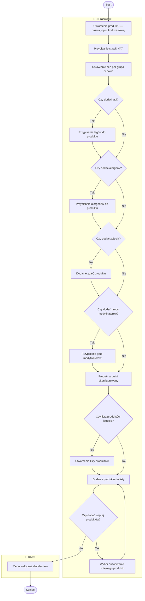

# Proces biznesowy 2 — Zarządzanie produktami i menu

```mermaid
flowchart TD
    Start([Start])

    subgraph Pracownik["👨‍🍳 Pracownik"]
        CreateProduct[Utworzenie produktu — nazwa, opis, kod kreskowy]
        SetTaxRate[Przypisanie stawki VAT]
        SetPrices[Ustawienie cen per grupa cenowa]
        AddTags{Czy dodać tagi?}
        AssignTags[Przypisanie tagów do produktu]
        AddAllergens{Czy dodać alergeny?}
        AssignAllergens[Przypisanie alergenów do produktu]
        AddImages{Czy dodać zdjęcia?}
        UploadImages[Dodanie zdjęć produktu]
        AddModifiers{Czy dodać grupy modyfikatorów?}
        AssignModifiers[Przypisanie grup modyfikatorów]
        ProductReady[Produkt w pełni skonfigurowany]
        ListExists{Czy lista produktów istnieje?}
        CreateList[Utworzenie listy produktów]
        AddToList[Dodanie produktu do listy]
        MoreProducts{Czy dodać więcej produktów?}
        SelectNext[Wybór / utworzenie kolejnego produktu]
    end

    subgraph Klient["🧑 Klient"]
        MenuReady[Menu widoczne dla klientów]
    end

    Start --> CreateProduct
    CreateProduct --> SetTaxRate --> SetPrices

    SetPrices --> AddTags
    AddTags -- Tak --> AssignTags --> AddAllergens
    AddTags -- Nie --> AddAllergens
    AddAllergens -- Tak --> AssignAllergens --> AddImages
    AddAllergens -- Nie --> AddImages
    AddImages -- Tak --> UploadImages --> AddModifiers
    AddImages -- Nie --> AddModifiers
    AddModifiers -- Tak --> AssignModifiers --> ProductReady
    AddModifiers -- Nie --> ProductReady

    ProductReady --> ListExists
    ListExists -- Nie --> CreateList --> AddToList
    ListExists -- Tak --> AddToList
    AddToList --> MoreProducts
    MoreProducts -- Tak --> SelectNext --> AddToList
    MoreProducts -- Nie --> MenuReady
    MenuReady --> End([Koniec])
```
