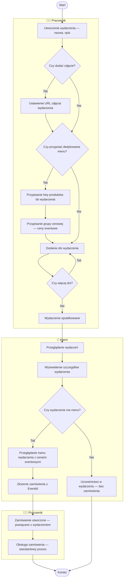

# Proces biznesowy 3 — Zarządzanie wydarzeniami

```mermaid
flowchart TD
    Start([Start])

    subgraph Pracownik["👨‍🍳 Pracownik"]
        CreateEvent[Utworzenie wydarzenia — nazwa, opis]
        AddImage{Czy dodać zdjęcie?}
        UploadImage[Ustawienie URL zdjęcia wydarzenia]
        LinkMenu{Czy przypisać dedykowane menu?}
        SelectList[Przypisanie listy produktów do wydarzenia]
        SelectPriceGroup[Przypisanie grupy cenowej — ceny eventowe]
        AddDays[Dodanie dni wydarzenia]
        MoreDays{Czy więcej dni?}
        EventReady[Wydarzenie opublikowane]
    end

    subgraph Klient["🧑 Klient"]
        BrowseEvents[Przeglądanie wydarzeń]
        ViewEvent[Wyświetlenie szczegółów wydarzenia]
        HasMenu{Czy wydarzenie ma menu?}
        BrowseEventMenu[Przeglądanie menu wydarzenia z cenami eventowymi]
        PlaceOrder[Złożenie zamówienia z EventId]
        AttendOnly[Uczestnictwo w wydarzeniu — bez zamówienia]
    end

    subgraph PracownikZam["👨‍🍳 Pracownik"]
        OrderCreated[Zamówienie utworzone — powiązane z wydarzeniem]
        ManageOrder[Obsługa zamówienia — standardowy proces]
    end

    Start --> CreateEvent
    CreateEvent --> AddImage
    AddImage -- Tak --> UploadImage --> LinkMenu
    AddImage -- Nie --> LinkMenu
    LinkMenu -- Tak --> SelectList --> SelectPriceGroup --> AddDays
    LinkMenu -- Nie --> AddDays
    AddDays --> MoreDays
    MoreDays -- Tak --> AddDays
    MoreDays -- Nie --> EventReady

    EventReady --> BrowseEvents
    BrowseEvents --> ViewEvent
    ViewEvent --> HasMenu
    HasMenu -- Tak --> BrowseEventMenu --> PlaceOrder
    PlaceOrder --> OrderCreated --> ManageOrder --> End([Koniec])
    HasMenu -- Nie --> AttendOnly --> End
```
